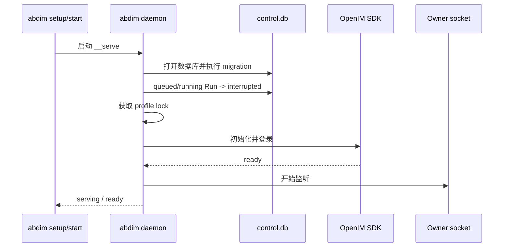
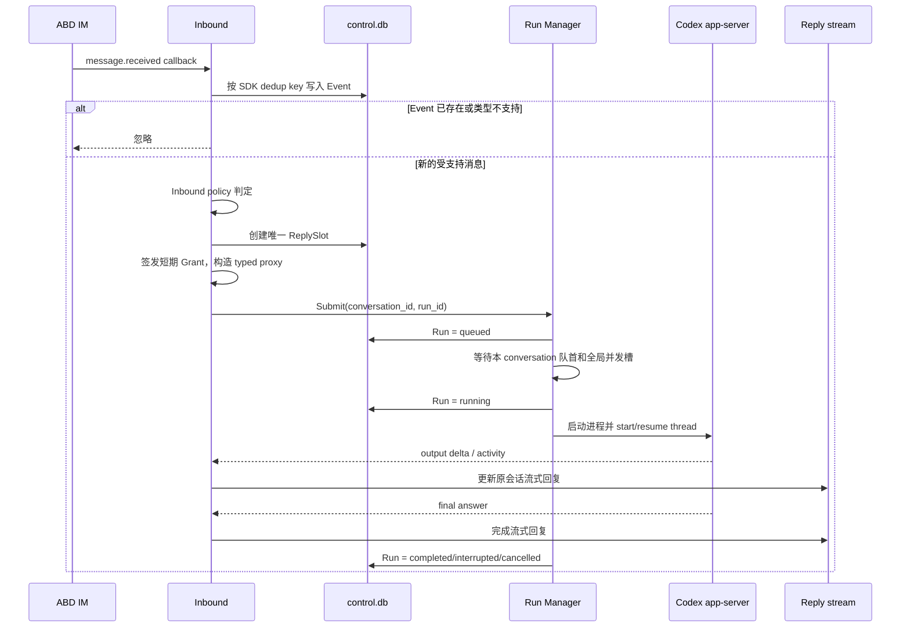
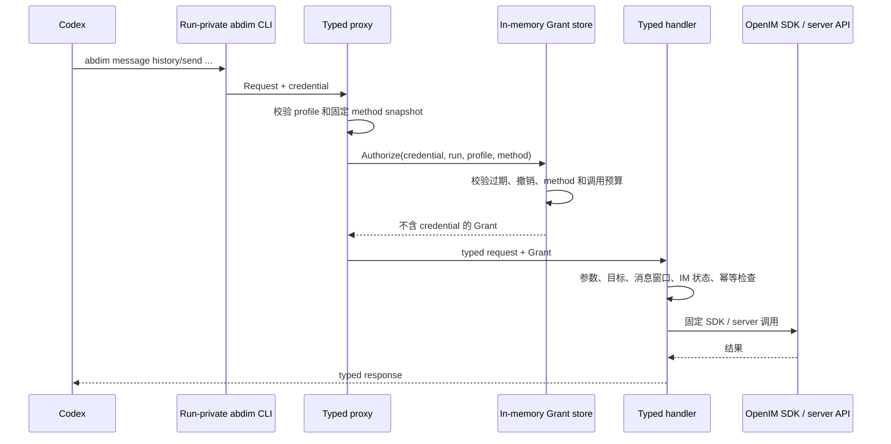
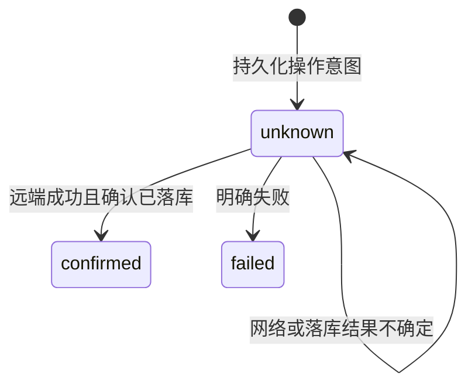
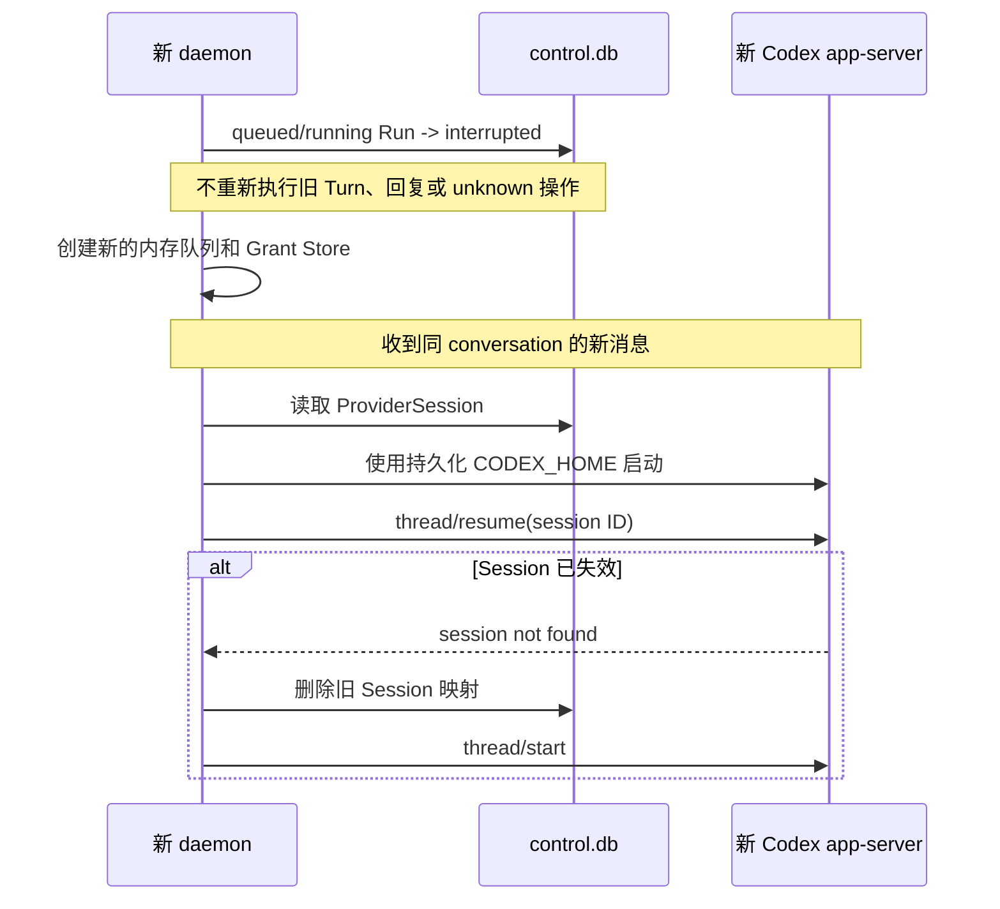

# abdim 架构

本文描述当前 `abdim` 的生产主路径：本机 daemon 登录 ABD IM，接收入站消息，按
conversation 调度 Agent Run，并将输出送回触发消息所在会话。Codex 是当前稳定
Provider，直接通过 `codex app-server` 接入；Hermes 和 OpenClaw 仅保留 ACP v1 adapter。

## 设计目标

- 以 ABD IM conversation 作为 Agent 上下文和调度边界。
- 同一 conversation 串行执行，不同 conversation 有界并行。
- daemon 独占 IM 连接、凭据引用、控制数据库和 owner RPC。
- 每个 Run 只获得短期、定方法、定窗口的 IM capability。
- 回复目标在 Agent 执行前固定，不能由模型输出或工具参数改写。
- 对重复事件、进程重启和结果不确定的远端写操作采取保守恢复策略。

## 系统总览

```text
                        当前用户机器

       ABD IM / OpenIM                         Owner CLI
              |                                    |
              | callback / SDK API                 | owner.sock
              v                                    v
  +-------------------------- abdim daemon --------------------------+
  |                                                                  |
  | Inbound    OpenIM bridge -> Event ledger -> Policy               |
  | Scheduling Conversation FIFO queues -> Global slots (2)          |
  | Boundaries ReplySlot / Reply service / Typed proxy / IM handlers |
  | State      control.db                                            |
  |                                                                  |
  +-----------------------------+------------------------------------+
                                |
                                | launch
                                v
  +------------------------- Run-private process --------------------+
  | Codex app-server / ACP Agent                                    |
  | Independent workdir + Unix socket + Grant + method snapshot      |
  |                                                                  |
  | output/activity  -------------------------------> Reply service  |
  | abdim CLI        ---> private socket ---> typed proxy            |
  +-----------------------------------------------------------------+
```

核心进程与边界：

| 组件 | 职责 | 持有的数据或能力 |
| --- | --- | --- |
| `abdim daemon` | 组合 SDK、调度器、Provider、权限代理和回复服务 | IM 登录态、控制数据库、owner socket |
| Owner CLI | setup、生命周期、查询、Run 取消等本机管理操作 | 只连接 owner socket，不打开 SDK 数据库 |
| Run-private CLI | 向 Agent 暴露当前 Run 获准的 typed IM 命令 | 私有 socket、短期 Grant、允许方法快照 |
| Codex app-server | 执行一个 Run 的 Agent Turn | 独立进程和工作目录、conversation 级 Codex 状态 |
| `control.db` | 保存恢复与诊断所需的有限控制数据 | Event、Run、Session、ReplySlot、Operation、Attachment |

daemon 是唯一直接持有 OpenIM SDK、控制数据库和 owner socket 的进程。Owner CLI 和
Run-private CLI 都通过 Unix socket 调用 daemon 暴露的固定接口，不直接打开 SDK 数据库。

## 启动与生命周期

`abdim setup` 完成登录、保存 profile 和凭据引用后启动后台 daemon。daemon 先完成
`control.db` migration 和遗留 Run 状态收敛，再取得 profile lock 并初始化 SDK；只有 SDK
ready 后才监听 owner socket，避免 CLI 在 IM 连接尚未可用时看到一个伪就绪进程。



一个 profile 同时只能有一个 daemon。关闭时先停止 owner 请求，再取消和等待入站 Run
收尾，最后释放 SDK 和 profile lock。

## 入站消息主链路

SDK callback 只负责复制事件并异步提交给入站编排。真正的处理路径如下：



Event 在执行 policy 之前持久化，因此重复 callback 不会重复创建 Run。Event 记录
profile sequence、conversation 和 message 标识，但不保存完整 prompt。

## 会话调度

OpenIM `conversation_id` 同时是队列键、上下文键和 Session 隔离键。Run Manager 为每个
conversation 维护一个内存队列，并使用全局信号量限制 Provider 并发数。

```text
Conversation A:  A1 running  ->  A2 queued  ->  A3 queued
Conversation B:  B1 running  ->  B2 queued
Conversation C:  C1 waiting for global slot

Global slots (capacity = 2):
    slot 1: A1
    slot 2: B1

约束：
    同一 conversation 最多一个 running Run
    不同 conversation 最多两个 Run 同时执行
    每个 conversation 当前最多保留两个 pending Run
```

排队、等待全局槽和执行阶段都受取消与 Grant 有效期约束。Run 真正取得执行槽后才启动
Provider 进程；等待期间取消或 Grant 过期，不会启动 Codex。生产配置的 Grant TTL 为
两分钟，从入站编排签发 Grant 时开始计时；Provider Turn 取得执行槽后另有两分钟
deadline。Turn 的实际截止时间取执行 deadline 与 Grant 到期时间中更早者。

该队列保证同一 conversation 按 daemon 接受并提交 Run 的顺序串行执行。它不是持久化
任务队列：daemon 重启不会重新提交旧队列中的 Run。

## Provider 与 Session

Codex adapter 为每个 Run 启动一个独立进程：

```text
codex app-server --listen stdio://
```

daemon 通过 stdin/stdout 上的 JSON-RPC 完成 `initialize`、`thread/start` 或
`thread/resume`、`turn/start`、流式事件接收和取消。

Run 隔离与 conversation 续接同时存在：

```text
profile + conversation
        |
        +-- SHA-256 state key
        |      +-- persistent CODEX_HOME
        |      +-- Codex thread files
        |
        +-- provider_sessions(profile, conversation, provider)
               +-- opaque thread/session ID

Run 1: fresh process + fresh workdir + private socket + Grant 1
Run 2: fresh process + fresh workdir + private socket + Grant 2
                         ^
                         └─ resume 同一 conversation 的 thread
```

- `CODEX_HOME` 按 profile 和 conversation 派生的不透明哈希键隔离并持久化。
- SQLite 按 `(profile, conversation, provider)` 保存 opaque Session ID。
- 同一 conversation 的后续 Run 使用新进程，但恢复已有 thread 和上下文。
- 不同 conversation 不共享 `CODEX_HOME` 或 Session ID。
- Provider 报告 Session 不存在时，daemon 删除旧映射并创建新 Session。
- Run 工作目录、私有 socket 和进程在 Run 结束后清理。

Codex app-server 当前使用 `approvalPolicy=never` 和 `sandbox=danger-full-access`，命令、
文件和网络工具可正常工作。permission 请求只回传 Codex 请求中的文件系统和网络范围。

这意味着本项目提供的是 **IM capability boundary**，不是同 UID 进程之间的操作系统安全
隔离。它信任运行 daemon 和 Codex 的当前本机用户；不能用来防御该用户下主动绕过
Run-private CLI、直接探测文件或 Unix socket 的恶意进程。

## Grant 与工具调用边界

默认入站 Run 的 method 列表为空，Agent 仍可通过 Reply Slot 回答触发消息，但不能主动
调用 IM tools。执行 `abdim inbound tools enable` 后，policy 才会从 daemon 的固定 registry
中选择 typed methods。



Grant 只保留执行所需字段：

- `run_id`、`profile_id` 和 principal。
- 允许的 typed method 集合。
- 过期时间和原子递减的调用预算。
- 当前 conversation 的消息读取窗口。
- 附件字节上限。

credential 是随机不透明值，Grant Store 只保存其哈希。Grant 仅存在于 daemon 内存中；
Run 结束、取消或 proxy 关闭时撤销，daemon 重启后也不会恢复。

权限校验分两层：proxy 负责 credential、Run、Profile、method、有效期和预算；typed
handler 负责输入 schema、具体 target、消息窗口、IM 当前状态和副作用幂等。Agent 看到的
命令列表是 Run 创建时的快照，owner 的 `run.cancel`、诊断等管理方法不会出现在该列表中。

## Reply Slot 与回复边界

Grant 控制“Agent 可以调用什么 IM 工具”，Reply Slot 控制“本次 Run 的回答可以发到哪里”。

```text
Inbound Event
      |
      | Provider 启动前 Reserve
      v
+---------------------- ReplySlot ----------------------+
| conversation_id      trigger_message_id               |
| recipient_id/group_id      run_id      operation_id    |
+----------------------------+---------------------------+
                             |
Agent output ----------------+---> Reply service
                                    |
                                    | Delivery 的目标只取自 ReplySlot
                                    v
                                ABD IM
```

每个 `(profile, event)` 只能创建一个 Reply Slot。Slot 在 Provider 启动前持久化，目标来自
已认证的入站事件；Agent 输出、prompt 和工具参数都不能替换 conversation 或收件人。

普通私聊使用 event-bound Stream 持续更新回复；Agent Workspace 使用对应的 Run Stream；
业务消息在 Turn 完成后投递最终文本。三条路径都从持久化 Slot 获取目标。

回复和其他远端写操作使用幂等键。操作在调用远端前先记录为 `unknown`：



`unknown` 不会自动重试，因为远端可能已经接受请求；盲目重试可能产生重复消息或其他
副作用。需要由 owner 查询和处置。

## 持久化与恢复

`control.db` 只保存运行控制数据，不保存 token、完整 prompt 或 Agent 输出：

| 实体 | 用途 | 重启后的行为 |
| --- | --- | --- |
| `Event` | 入站去重、profile sequence、conversation/message 标识 | 保留，重复 callback 继续去重 |
| `Run` | conversation、event、状态和有限错误原因 | 遗留 `queued/running` 标记为 `interrupted` |
| `ProviderSession` | conversation 到 opaque Provider Session ID 的映射 | 保留，供后续 Run resume |
| `ReplySlot` | 将 Event/Run 固定到原会话和回复目标 | 保留，不允许换目标 |
| `Operation` | 写操作的 `confirmed`、`failed`、`unknown` 状态 | 保留，不自动重放 `unknown` |
| `Attachment` | Run 范围的不透明附件引用和额度 | 元数据保留；旧 Grant 不恢复，旧 Run 不能继续访问 |

旧 migration 中仍有已废弃的 `grants` 表，用于兼容已有 profile 数据库；当前生产代码不
读写该表。

### “恢复”的准确含义



这里有两类不同的恢复：

1. **运行状态收敛**：daemon 重启后将上个进程遗留的活跃 Run 标记为 `interrupted`，避免
   永久停留在 `queued/running`。
2. **会话上下文续接**：后续新 Run 恢复同一 conversation 的 Codex thread。

当前不支持从崩溃点续跑原 Turn，也不会重新发送旧 Provider 输出或自动重试结果不确定的
远端操作。因此“持久化 Run”表示生命周期可追踪和状态可恢复，不表示持久化执行队列。

## 关键不变量与边界

- 一个 profile 同时只运行一个 daemon。
- 同一 conversation 最多运行一个 Run；一个 profile 当前最多并行运行两个 Run。
- 一条入站 Event 只创建一个 Reply Slot；所有自动回复都绑定原 conversation。
- 通过 Run-private surface，Provider 只能发现获准的 typed methods，不能调用 owner 方法。
- 消息读取不能越过 Grant 的 conversation 和消息窗口。
- Run 结束、取消、Grant 过期或 proxy 关闭后，后续工具调用失败。
- 远端写操作不自动重试 `unknown` 结果。
- 控制数据库和日志不保存 token、完整 prompt 或 Agent 输出。
- capability boundary 不等同于同 UID 下的 OS 沙箱；当前本机用户属于信任边界。
- 重启恢复不等同于中断 Turn 续跑。

## 代码导航

| 路径 | 职责 |
| --- | --- |
| `cmd/abdim` | setup、daemon 生命周期、组合根、owner/run CLI |
| `internal/bridge` | SDK 登录和生命周期管理 |
| `internal/bridge/abdim` | daemon-owned OpenIM SDK/server adapter |
| `internal/events` | 持久化事件账本、去重、sequence 和 watch |
| `internal/daemon` | 入站 policy、Run/Grant/Reply 组装和 owner RPC |
| `internal/agent/run` | conversation 队列、有界并发、deadline 和取消 |
| `internal/agent/provider/codex` | Codex app-server JSON-RPC adapter |
| `internal/agent/provider/acp` | Hermes/OpenClaw 的固定 ACP v1 adapter |
| `internal/agent/access` | Run-private socket 和 CLI 环境 |
| `internal/agent/grant` | 内存短期 Grant 和调用预算 |
| `internal/agent/proxy` | Run-scoped typed method 调用边界 |
| `internal/reply` | Reply Slot、普通 Stream 和 Workspace Run Stream |
| `internal/control` | Event、Run、Session、Reply、Operation、Attachment 持久化 |
| `internal/commands` | owner/run CLI 的固定命令 schema |
| `internal/service` | daemon-owned typed 读取服务和 Run 运维服务 |
| `internal/capability` | IM 写操作 handlers 和业务约束 |
